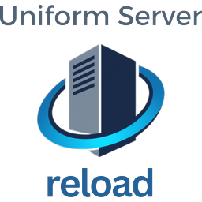

# Uniform Server Reload

**A community fork of [The Uniform Server](https://github.com/iamola/uniserver) — continued as an independent project with its own version line.**

**No external dependencies, no installation, no configuration:** the complete WAMP stack — Apache, MySQL, PHP 8.3/8.4/8.5, phpMyAdmin and the updated controller — ships as a **single self-extracting 7-Zip archive** ([`UniServer-Reload.exe`](https://github.com/Wolfram33/uniserver-reload/releases/tag/latest)). Unpack it anywhere and everything is immediately ready to run. Nothing needs to be downloaded from SourceForge or windows.php.net, no modules need to be added, no settings need to be changed. Portable as ever: no installer, no registry entries.

> ### ⚡ Current PHP versions — upstream never made it past 8.3
> The original server is stuck on PHP 8.3 (no updates since November 2023) — a dealbreaker for modern apps and frameworks. This fork ships **PHP 8.3, 8.4 and 8.5 preinstalled and switchable** in the controller (*PHP > Select PHP version*), repackaged from the official windows.php.net builds. CI packages new PHP releases automatically, so future versions reach the bundle quickly — and every build is smoke-tested with each installed PHP version before it is published.

> ### 🎉 Multiple virtual hosts finally work — including HTTPS
> One of the most notorious problems of the original Uniform Server is fixed in this fork: **creating more than one virtual host silently failed.** The controller handed the Windows hosts file entry to the interactive EdHost utility as a command line call — but EdHost has no command line interface, so **nothing was ever written** and the new host name simply did not resolve. It looked like a broken Apache configuration and was masked whenever an entry already existed from another tool. UniServer Reload writes the hosts entries itself — deduplicated, elevated only when needed, and verified with a clear message if anything fails. Create as many vhosts as you like: `http://` **and** `https://` work for every one of them.

The original project — a free lightweight WAMP server solution for Windows — has seen no commits since November 2023.
This fork imports the source of its two control programs (UniController and UniService) as a clean starting point for further development.

* Upstream repository: https://github.com/iamola/uniserver (imported at commit `1704fa1`, 2023-11-25)
* Upstream downloads: https://sourceforge.net/projects/miniserver/
* License: BSD (see [LICENSE](LICENSE)) — all credit for the original work goes to The Uniform Server Development Team.
* Fork initiated by **Rob de Roy**, who gave the impulse to revive the project.

## Repository contents

This repository contains the **source code of the controllers only**, written in Free Pascal and compiled with [Lazarus](https://www.lazarus-ide.org/):

* **[UniController](UniController/)** — the main GUI that starts, stops and configures Apache, MySQL/MariaDB and PHP (see its [README](UniController/README.md) for build instructions)
* **[UniService](UniService/)** — a plugin that runs the servers as a Windows service (see its [README](UniService/README.md))

The actual server binaries (Apache, PHP, MySQL, phpMyAdmin, …) are not part of this repository; they are packaged in the Uniform Server ZeroXV releases on SourceForge.

## Downloads

Every push triggers a build that updates the rolling release with fixed download links (no login required):

**➡ [Latest development build](https://github.com/Wolfram33/uniserver-reload/releases/tag/latest)**

| File | Description |
|---|---|
| **`UniServer-Reload.exe`** | **All-in-one, zero-setup package: the complete server (Apache, MySQL, phpMyAdmin, PHP 8.3/8.4/8.5, updated controller) in one self-extracting 7-Zip archive — unpack and it runs, no further downloads or configuration** |
| `UniServer-Reload.zip` | The same all-in-one package as a plain zip — for setups where antivirus software blocks the unsigned self-extracting exe; extract it into an empty folder and start `UniController.exe` |
| `UniController.exe` | Controller only — for updating an existing installation |
| `UniService.exe` | Windows service module — replaces `utils\UniService.exe` in an existing installation; started from the controller via *Extra > Run Apache/MySQL as Windows service* |
| `UniServer-Reload_php84_module.zip` | PHP 8.4 module (latest official thread-safe x64 build, Uniform Server layout) — for adding to an existing installation |
| `UniServer-Reload_php85_module.zip` | PHP 8.5 module — for adding to an existing installation |
| `UniServer-Reload_mariadb_module.zip` | Latest MariaDB LTS as database engine — fresh installs only: delete `core\mysql` first, then unzip into the server folder |

The single-file downloads exist only for users who want to upgrade an existing Uniform Server installation piece by piece; with `UniServer-Reload.exe` none of them are needed.

Quick start: run `UniServer-Reload.exe`, pick an empty target folder without spaces in the path (e.g. `C:\UniServer-Reload`), then start `UniController.exe` from it — the server extracts directly into the chosen folder (no `UniServerZ` subfolder since 1.3.0) and is ready to go. To switch the PHP version stop Apache first, then use *PHP > Select PHP version*.

## Support the project

UniServer Reload is free and open source. If it saves you time, you can support its development with a donation: **[Donate via PayPal](https://www.paypal.com/paypalme/robderoy)** — thank you!

## Upgrading

There is no in-place updater — the package is portable by design. Two paths:

* **Controller-only upgrade** (e.g. 1.2.0 → 1.2.1): replace `UniController.exe` (server folder) and `UniService.exe` (its `utils` subfolder) with the single-file downloads from the release page — that is exactly what they are published for. Your `www` content, databases and configuration stay untouched. (The version shown on the splash and test pages comes from `AppVersion=` in `home\us_config\us_config.ini`; update it by hand if you want the pages to match.)
* **Full upgrade** (new Apache/PHP/MySQL builds): unpack the new bundle into a fresh folder and move over your `www` content, your databases (`core\mysql\data`) and any configuration you changed (e.g. `home\us_config\us_user.ini`, `core\msmtp\msmtprc.ini`, certificates in `core\apache2\server_certs`).

## Versioning

UniServer Reload follows its **own version line starting at 1.0.0** (`MAJOR.MINOR.PATCH`), independent of upstream's 15.x numbering — the origin stays credited, but the project evolves on its own.

* **Stable releases** are built from git tags (`vX.Y.Z`) and published as versioned GitHub releases with versioned file names (e.g. `UniServer-Reload-1.2.0.exe`).
* The **rolling `latest` release** continues to be updated on every push with development builds.
* The version is visible everywhere: the *About* dialog, `UniController.exe version` on the command line, the splash page, the exe file properties and `home\version.txt` in the bundle (which also records the ZeroXV base package the bundle was built from).
* Single source of truth is [`UniController/reload_version.inc`](UniController/reload_version.inc): CI stamps it into the exe VersionInfo and the bundle, and refuses to build a release tag that does not match it.

Release procedure: bump the version in `reload_version.inc`, commit, tag the commit `vX.Y.Z`, push branch and tag — CI builds, verifies and publishes the versioned release.

## HTTPS (`https://localhost` without browser warning)

The controller generates a self-signed `localhost` certificate on first start and enables SSL automatically — `https://localhost` works right away, but browsers mark self-signed certificates as "not secure" until they are trusted. To get the padlock without a warning:

1. **Upgrading from an older install?** Delete `core\apache2\server_certs\server.crt` and `server.key` first (with Apache stopped), then start UniController — certificates created by the old generator lack the subjectAltName entries Chrome requires and are rejected even when trusted. Fresh installs skip this step.
2. On its **first interactive start UniController asks right away** whether to trust the certificate — answer **Yes** and confirm the Windows security prompt. (Any time later or again: **Apache → Apache SSL → Trust certificate in Windows**.)
3. **Restart the browser completely** (Chrome: enter `chrome://restart` in the address bar — closing the tab is not enough, and check the system tray for background instances).
4. Open `https://localhost` — the padlock now shows without a warning.

The certificate covers `localhost`, `127.0.0.1` and `::1`, is valid for 10 years and is only trusted for the current Windows user.

**Firefox:** unlike Chrome and Edge, Firefox ignores the Windows certificate store by default and keeps warning even after the certificate is trusted. When Firefox is installed, the controller therefore offers (once, after trusting) to enable Mozilla's official `ImportEnterpriseRoots` policy for the current user, which makes Firefox use the Windows store too — undo any time by deleting the value under `HKCU\Software\Policies\Mozilla\Firefox\Certificates`. Alternatively import the certificate manually in Firefox's certificate settings.

**Note:** In this fork HTTP and HTTPS serve the **same** `www` folder — apps placed in `www` work on both `http://localhost/...` and `https://localhost/...`. (Upstream serves HTTPS from a separate `ssl` folder, which makes apps 404 over HTTPS.) To restore the classic split set `US_ROOTF_SSL=./ssl` in `home\us_config\us_user.ini`. With virtual hosts both ports also behave identically: requests with unknown host names (e.g. access by IP address) fall back to `www` on http **and** https instead of landing in the first vhost.

## E-mail: PHP `mail()` with a real SMTP account

PHP's `mail()` is wired to the bundled **msmtp** SMTP client. Enter your real SMTP access in `core\msmtp\msmtprc.ini` (ready-made blocks for port 587/465 and Gmail are included), set `account default : <name>` at the bottom, and your apps send real mail. Test with `core\msmtp\Send_test_email.bat`; errors are logged to `core\msmtp\msmtp.log`.

Spam-filter friendliness built in: outgoing mails automatically get the standard headers spam filters check for (`Date`, `Message-ID`, `MIME-Version`, `Content-Type`) via a small wrapper, and TLS certificate verification is on by default (Mozilla CA bundle included). What remains on your side: send through an authenticated provider account (it DKIM-signs your mail), keep the `From:` address aligned with that account, and for your own domain set up SPF/DMARC DNS records. Gmail/Outlook need an app password.

## Development-friendly defaults

The stock configuration is extremely conservative (2 MB PHP uploads, 1 MB MySQL packets, 32 MB InnoDB pool). This fork ships with limits sized for development machines:

| Setting | Upstream | Reload |
|---|---|---|
| PHP `memory_limit` | 128M | **512M** |
| PHP `upload_max_filesize` / `post_max_size` | 2M / 8M | **256M / 256M** |
| PHP `max_execution_time` / `max_input_time` | 30s / 60s | **120s / 120s** |
| PHP `max_input_vars` / `max_file_uploads` | 1000 / 20 | **5000 / 50** |
| MySQL/MariaDB `max_allowed_packet` | 1M | **256M** |
| MySQL/MariaDB `innodb_buffer_pool_size` | 32M | **512M** |
| MySQL/MariaDB `table_open_cache`, buffers, `tmp_table_size` | minimal | **raised accordingly** |

All values remain editable: PHP via *PHP > Edit selected configuration file*, MySQL/MariaDB via `core\mysql\my.ini`.

**Extensions enabled by default in every PHP version** (all ini variants **including `php-cli.ini`**, so CLI scripts and cron jobs get the same set): on top of the stock set (`gd`, `mbstring`, `exif`, `mysqli`, `openssl`, `pdo_mysql`) this fork also enables `pdo_sqlite`, `sqlite3`, `fileinfo` and `curl` — the ones small PHP apps most often need but that upstream ships commented out. Every build's smoke test starts Apache once per installed PHP version and fails unless PHP executes and all of these extensions actually load, so a version switch in UniController can never silently drop them.

**Consoles in Reload look:** *Server Console* and *MySQL Console* open in Windows Terminal with a translucent black acrylic background and the Reload icon in the tab (Windows Terminal ships with Windows 11; on Windows 10 install it from the Microsoft Store). The opacity is set in `home\us_config\us_user.ini`: `CONSOLE_OPACITY=50` (50–100; `100` restores the classic opaque cmd window, which is also used automatically when Windows Terminal is not installed). The controller registers the profile *UniServer Reload Console* as a Windows Terminal fragment in `%LOCALAPPDATA%\Microsoft\Windows Terminal\Fragments\UniServer Reload\`, so the profile also appears in the terminal's own dropdown; delete that folder to remove it.

## Development goals

* [x] Support for current PHP versions (8.4 / 8.5) in the controller's version switching
* [x] HTTPS out of the box: the controller auto-generates a `localhost` certificate on first start, enables SSL and **proactively offers to trust the certificate on the first start** (also available any time via *Apache > Apache SSL > Trust certificate*) to remove the browser warning
* [x] Vhosts with a folder picker: *Apache > Apache Vhosts > Create Apache Vhost* now takes either a portable name (created under `vhosts\`) **or a full path via Browse…** — point a host straight at `D:\projects\app` with no copying into `www`, no duplicated project folders
* [x] **Multiple vhosts actually work** — fixed the long-standing upstream bug that only one vhost ever resolved: the controller now writes the Windows hosts file entries itself (deduplicated, verified, elevation only when needed) instead of handing off to the interactive EdHost utility, which never wrote anything
* [x] Per-vhost HTTPS: creating a vhost also writes a matching `:443` block and rebuilds the server certificate so its subjectAltName covers every vhost domain (plus `*.domain`). `https://app.test` works like `https://localhost` — the controller offers to re-trust the rebuilt certificate right after creating the vhost. Default vhosts guard **both** ports: unknown host names fall back to `www` on http and https alike
* [x] Automated builds via CI (Lazarus build on Windows runners)
* [x] Package current PHP versions as ready-to-use modules (built by CI, see Downloads)
* [x] Automatic rolling GitHub release with fixed download links
* [x] Package current Apache / MariaDB versions (bundle ships the latest Apache Lounge 2.4.x build; MariaDB LTS available as a module) — every bundle is smoke-tested in CI: Apache is started on the runner and must serve a PHP-rendered page
* [x] Command-line control of the servers: start/stop/restart/status/version with exit codes, safe for unattended scripts (see the bundled manual page *Command line parameters*)
* [x] Own version line with tagged stable releases (see [Versioning](#versioning))
* [x] Reduce build-time dependencies on upstream infrastructure: the ZeroXV base package is mirrored automatically into the `base-package` release on first CI build; builds prefer the mirror and fall back to SourceForge
* [x] Remove dead upstream services from the controller: the DtDNS updater and the *Server Internet status* window relied on services (dtdns.com, uniformserver.com version file) that no longer exist or are unmaintained
* [ ] Work through the open issues of the upstream repository (see below)

## Bugs & feature requests (this fork)

Found a problem in UniServer Reload, or missing a feature? Please use **this repository's issue tracker**:

**➡ [Known issues and reports](https://github.com/Wolfram33/uniserver-reload/issues)** — every currently known problem of the fork lives there.

Please do not report fork problems to the original project; its tracker is unmaintained.

## Upstream issue triage (original project)

For reference — what this fork did about the issues that remain [open in the original repository](https://github.com/iamola/uniserver/issues):

| Issue | Status | Notes |
|---|---|---|
| [#18](https://github.com/iamola/uniserver/issues/18) PHP 8.4 & 8.5 modules | **Done** | PHP 8.4 and 8.5 ship preinstalled in the all-in-one bundle and as standalone modules, built by CI from the official windows.php.net releases. |
| [#20](https://github.com/iamola/uniserver/issues/20) Future PHP versions | **Partially addressed** | php84/php85 added following the existing per-version pattern, and CI packages new PHP releases automatically; a fully dynamic version discovery in the controller remains future work. |
| [#21](https://github.com/iamola/uniserver/issues/21) Host editor rejects TLDs > 3 letters | **Fixed** | Server-name and e-mail validation accepts TLDs of 2–63 letters (`.test`, `.online`, `.museum`, …), and the controller no longer depends on EdHost for vhosts — it writes the Windows hosts file itself. The bundled stand-alone `EdHost.exe` utility is unchanged upstream code. |
| [#14](https://github.com/iamola/uniserver/issues/14) Command console customization | **Partially addressed** | Console windows were restyled (white on black instead of black on aqua); user-configurable colours remain future work. |
| [#17](https://github.com/iamola/uniserver/issues/17) Update modules/plugins | **Partially addressed** | The bundle ships the latest Apache Lounge build, current PHP versions and a MariaDB LTS module via CI; further module refreshes (e.g. phpMyAdmin) are ongoing release tasks. |
| [#19](https://github.com/iamola/uniserver/issues/19) Forum captcha broken | Not applicable | Concerns the upstream project's forum infrastructure, not this code base. |

---

## Original project description

Uniform Server is a free lightweight WAMP server solution for Windows.
Build using a modular design approach, it includes the latest versions of Apache, MySQL or MariaDB, PHP (with version switching), phpMyAdmin or Adminer.

No installation required! No registry dust! Just unpack and fire up!

**Uniform Server Zero XV** can be found at SourceForge at https://sourceforge.net/projects/miniserver/ or can be downloaded by clicking on the button below:

### Uniform Server Core

The base version which is suitable for most users is the 15_x_x_ZeroXV.exe that contains the following:

 * Unicontroller - The Uniform Server Controller
 * Apache
 * PHP
 * MySQL
 * PhpMyAdmin
 * msmtp - A SMTP mail client
 * Cron Scheduler
 * Documentation

### Uniform Server Modules

Apart from the core, The Uniform Server Zero XV has a modular design. Install only modules (plugins) that you require.
Each server requires a controller, which automatically detects installed plugins.

The following are the optional plugins that can be used to enhance the Uniform Server Core from the **XV Modules** folder:

* **Core:** UniService - Enables the Servers to be run as a Windows Service.
* **PHP:** PHP 7.0 to 8.3
* **Database:** MariaDB
* **Database Administration:** Adminer, MySQL Auto Backup
* **FTP:** FileZilla Server with a custom controller
* **Perl:** Strawberry Perl
* **Portable Browser:** Pale Moon
